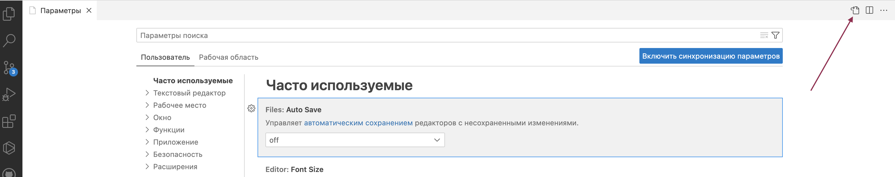
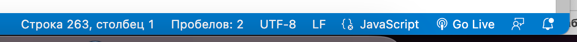

## Это репозиторий-инструкция для установки всего необходимого софта на удаленную машину. ##

### В ней содержатся установочники всех необходимых программ и плагинов + хаки для их установки. ###

Для начала надо склонить весь репозиторий как .zip архив. Далее идти по пунктам и накатывать необходимый софт.

<b>Git</b>

    В папке Git лежит .exe файл, устанавливаем как-обычно.

 

<b>Visual Studio Code</b>

 
    В папке <b>VSCode</b> лежит .exe файл, устанавливаем как-обычно.(<b>Версия выше той, которая лежит в репозитории не поддерживается</b>)
  
    Внутри в папке <b>Plugins</b> лежат базовые плагины для VSCode

 

<b>Node JS</b>

 
    <b>Проверенная последовательность действий</b>
    <ol>
        <li>Скачать zip архив с nodejs (архив содержит как исполняемый файл nodejs, так и npm)</li>
        <li>Распаковать и скопировать содержимое по пути “C:\Users\%User%\AppData\Local\Programs\node” (для своего пользователя)</li>
        <li>Добавьте путь к ноде в PATH переменную среды:
            <ul>
                <li>Открываем управление переменными среды (winkey+R, вводим “rundll32 sysdm.cpl,EditEnvironmentVariables”)</li>
                <li>В окне “Переменные среды для пользователя” выбираем Path и нажимаем Изменить...</li>
                <li>Добавляем наш путь “C:\Users\%User%\AppData\Local\Programs\node”</li>
            </ul>
        </li>
        <li>
            Дальше открываем новое окно терминала (winkey+R, вводим cmd),и проверяем версию ноды и npm в терминале командами <code>node —v</code> и <code>npm —v</code> соответственно)
        </li>
    </ol>
    <a href="https://stackoverflow.com/questions/37029089/how-to-install-nodejs-lts-on-windows-as-a-local-user-without-admin-rights/44951189#44951189"> Ссылка на оригинальный мануал (актуальную врсию)</a>

 

<b>Настройка eslint и prettier для VSCode</b>

 
    <ul>
        <li>Устанавливаем расширения для vscode из файлов .vsix, лежат в папке <b>VSCode/Plugins</b></li>
        <li>Открываем settings.json в vscode
            
        </li>
        <li>
            Добавляем в конфиг :
                <code>
                "editor.defaultFormatter": "dbaeumer.vscode-eslint",
                "editor.formatOnSave": true,
                "editor.codeActionsOnSave": {
                "source.fixAll.eslint": true
                }
            </code>
        </li>
        <li>
            В самом редакторе проверяем настройку end of line  sequence? (LF на скрине)
            
        </li>
    </ul>

 

<b>Установка расширений для Google Chrome</b>

 
    В папке <b>ChromeExtensions</b> лежат React и Redux devtools. Чтобы их установить нужно:
    <ul>
        <li>Отрываем Chrome>Меню>Расширения</li>
        <li>Сверху справа включаем режим разработчика</li>
        <li>Перетаскиваем файл формата .crx в Chrome, браузер попросит подтверждение установки. Потверждаем.</li>
    </ul>

